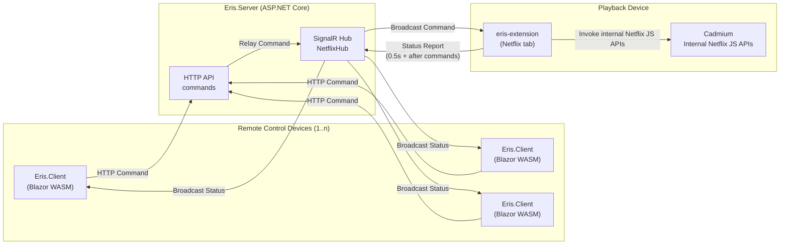

# Eris

Remote-control for Netflix in the browser, powered by WebSockets + WebAssembly

## 🚀 Overview

Eris is a browser-based control system designed to let you control your Netflix playback from another device. Built using modern web technologies (Blazor WebAssembly, WebSockets, ASP.NET Core SignalR) it provides a real-time link between a browser client and a remote controller.

<p align="center">
  
</p>

### Key features
- Real-time communication via WebSockets / SignalR for low latency control.  
- WebAssembly client (Blazor) running in the browser for rich UI and direct integration.  
- Extension / browser client component hooking into Netflix playback to send/receive commands.  
- Shared “server” component (ASP.NET Core) acting as the hub and gateway between controller UI and Netflix playback tab.  
- Ability to issue commands like play/pause, seek, skip, etc. remotely from a controller interface.  
- Extensible architecture - you could adapt to other streaming services or add custom controls.

## 📦 Project Structure

The repository is organised into several parts:

/Client - Blazor WebAssembly client (remote control UI)  
/Server - ASP.NET Core WebSocket / SignalR-backend  
/Shared - Shared types, models and contracts between client & server  
/eris-extension - Browser extension (Chrome/Edge) that integrates with Netflix's Cadmium playback APIs.
Eris.sln - Solution file

## 🛠 Getting Started

### Prerequisites  
- .NET 8 SDK installed (https://get.dot.net/8)
- A modern browser (Chrome, Edge, Firefox)  
- (Optional) Source control: Git  

### Build & Run  
1. Clone the repository  
   ```bash
   git clone https://github.com/peter-mghendi/eris.git  
   cd eris  
   ```
2.  Open the solution `Eris.sln` in Visual Studio or via CLI.
3.  Build the solution.
4.  Start the `Eris.Server` project - this should launch both the ASP.NET server and the Blazor Webassembly frontend at `http://localhost:5091` by default.
5.  Start the Client project (Blazor WebAssembly) — it should load in the browser.
6.  Install/enable the browser extension component (found under `/eris-extension`) - it will automatically activate on any tabs that navigate to `https://netflix.com/watch`.
7.  Begin remote controlling playback (play/pause, skip, seek, etc).

### Configuration
-   Server URL and ports can be configured in `appsettings.json`. If the server address or port is updated, ensure to match this in the `eris-extension` and `Eris.Client` projects.
-   `Eris.Server` uses SQLite for data storage. Ensure the `DefaultConnection` parameter is set in `appsettings.json`.
-   You may adapt or extend control commands in the Shared project and propagate to client + extension.    

## 🧩 Architecture

Eris is split into three cooperating runtimes:

1. **Eris.Client (Blazor WebAssembly)**  
   A remote-control UI that lives in any modern browser.  
   - Sends control commands (play/pause/seek/etc.) to the Eris server over HTTP.  
   - Opens a SignalR connection to receive **real-time status updates** from the playback device.  
   - Assumes it is a *remote*, not the playback source.

2. **Eris.Server (ASP.NET Core + SignalR Hub)**  
   The relay/hub that binds controllers to the playback tab.  
   - Exposes HTTP endpoints for commands.  
   - Relays those commands to all connected SignalR clients.  
   - Receives status reports from the extension and broadcasts them to all controllers.  
   - **Currently does not identify or isolate sessions/clients** — updates are broadcast to everybody on the hub.  
     The asssumption is that you have:  
     **1 playback device** + **1..n remote controls**.

3. **Eris.Extension (Browser extension injected into Netflix tab)**  
   The playback-side agent.  
   - Connects to the SignalR hub as a client.  
   - Receives commands and applies them via **internal, undocumented Netflix JS player APIs**.  
   - Reports full playback state continuously back to the hub.  
   - Tracks Netflix UI changes indirectly by observing internal player state (not DOM).

### High-level topology



### Command path (controller → playback)
1.  A user taps a control in **Eris.Client**.
2.  The client sends an HTTP request to **Eris.Server** (e.g., `POST /api/commands/play`).
3.  The server publishes this onto the **SignalR hub**.
4.  **Eris.Extension**, connected to the hub, receives the command.
5.  The extension executes the command using Netflix’s **internal "Cadmium" playback APIs**.
6.  If successful, the extension immediately sends a fresh status report to the hub.

**Important note:** because the hub broadcasts to _all_ connected SignalR clients, any playback tab connected to the hub would receive the same commands. Right now Eris assumes there is only one playback device per server instance.

### Status path (playback → controllers)

The extension is effectively the “source of truth” for playback state.
-   After _every successful command_, it pushes an immediate status update.
-   Otherwise, it polls and reports state **every 500ms**.
-   The report includes rich metadata such as:
    -   seek position, duration, playback rate
    -   volume + mute
    -   paused/playing/buffering states
    -   title, show/movie name
    -   season/episode + cover images
    -   and any other fields surfaced by Netflix’s internal player objects

This fast cadence makes UI changes done _directly on Netflix_ (keyboard, mouse, Netflix UI buttons) appear almost instantly on all remote control clients.

**Tuning:**  
500ms is great for localhost and decent networks, but may need adjustment for:
-   cloud-hosted servers
-   slow/expensive networks
-   battery-sensitive devices

### Reconnection behavior

There are two layers of reconnect logic:

1.  **SignalR built-ins**  
    Automatic reconnect + stateful reconnect where supported.
    
2.  **Extension proactive reconnect**  
    Before each status report, the extension checks whether it is connected.  
    If disconnected, it attempts a reconnect **once** before sending the report.  
    Since reports occur every 500ms, Eris effectively retries at least twice per second.

No other reconnection optimization exists yet.

### Known weak points
-   **Tab suspension** is the biggest disconnect source.  
    Especially on mobile browsers (for remote clients), which frequently suspend background tabs aggressively.  
    Result:
    -   clients/extensions appear “dead” until refreshed
    -   no clear end-to-end connection health is shown yet  
        A future improvement is a visible “chain status” indicator:  
        **Client ↔ Server ↔ Extension ↔ Netflix Player**.
        
-   **No session isolation / multi-playback routing**  
    Solving this likely requires:
    -   authenticated users across `Eris,Client` and `eris-extension`
    -   session IDs / rooms / channels
    -   explicit “playback device registration”
    -   per-room SignalR groups  
        This would allow shared cloud-hosted Eris instances.
        
-   **Server discovery / configuration is manual**  
    The extension and client currently connect to a configured hub URL.  
    Future improvements could add:
    -   auto-discovery on LAN
    -   querystring / manifest parameter overrides
    -   QR pairing flows (remote scans playback tab code)

### Why this structure?
-   **Blazor Webassembly** enables rich, modern remote UI shared C# contracts.
-   **SignalR** enables dead-simple real-time RPC over websockets.
-   **Extension-side Netflix API usage** keeps the client clean (no scraping, no DOM coupling) and isolates breakage to one surface: Netflix internal JS changes.

----------

## ⚠️ Limitations

Eris is an experimental project and has several inherent limitations:

### Browser-only support  
Eris only works when Netflix is playing in a **desktop browser** that supports the Eris extension.  
Currently supported environments:
- Chrome / Chromium-based browsers (Edge, Brave, etc.)
- Firefox (with additional adaptation)

Not supported:
- Smart TV browsers  
- Native mobile apps (Android / iOS)  
- Streaming sticks (Chromecast, Fire Stick, Roku)  
- Smart TV OS apps (Tizen, webOS, Android TV, etc.)

The remote-control UI, however, is a regular webassembly web app and can run on any device with a modern browser - the app assumes support for websockets, webassembly and progressive web apps is present.

### Dependent on internal, undocumented Netflix APIs  
Eris hooks into **internal JavaScript APIs and objects** exposed by the Netflix player.  
These APIs:
- Are undocumented  
- Are subject to change without notice  
- May differ between user accounts due to A/B testing  
- Could break Eris entirely if Netflix alters their internal player architecture

### Not an officially supported integration  
Eris is not affiliated with or endorsed by Netflix. It operates through browser scripting and may be affected by:
- Anti-automation measures  
- Playback restrictions  
- A/B tested UI layouts

### Requires active foreground tabs  
Some browsers restrict JavaScript execution for background or suspended tabs. If the Netflix tab is throttled or put to sleep:
- Command latency may increase  
- Some actions may fail to execute  
- Real-time status reporting may stop  

### Limited command set  
Only a subset of Netflix playback controls are supported at the moment. Complex features such as:
- Subtitle switching  
- Audio track changes  
- Choosing profiles  
- Navigating episodes  
- Browsing the catalogue
…are not yet implemented.

### Requires local network connectivity to the Eris server  
Eris assumes that:
- The controlling device and the Netflix-playing browser share reachable network paths  
- The server is accessible over the configured URL  

Offline or cross-network scenarios (e.g., remote WAN control) require custom configuration.

### Minimal security  

> This does **not** expose your computer to network threats. The extension is sandboxed to your Netflix tabs, and can only view and control your playback.

The assumption is:
- You run Eris locally  
- You trust all devices on the network

This is not suitable for hostile networks or multi-tenant environments without further hardening.


### Extension installation friction  
The Eris extension is not published on any store yet. Users must:
- Install it manually  
- Enable developer mode  
- Reload the extension on updates  

### Experimental reliability  
Eris is not production-hardened. Expect:
- Occasional desync between controller and extension  
- Rare dropped WebSocket messages  
- Latency spikes depending on browser/vendor  
- Temporary failures requiring a refresh  

## 📌 Why “Eris”?

Named after the Greek goddess of discord, Eris brings harmony to your streaming chaos - you’ll never need to scramble for your keyboard or mouse again when controlling Netflix.

## 📝 Contributing

Contributions are welcome!
-   Please open an issue for feature requests or bug reports.
-   Fork the repo, create a feature branch, and submit a pull request with tests where applicable.
-   Ensure coding standards match existing style.
-   Update the README or architecture docs if you introduce new services, commands or flows.

## 📄 License

This project is open source under the [MIT license](LICENSE).

----------

Thanks for checking out Eris! Happy streaming!
